# sky130-10-bit-SAR-ADC
The following repository contains the ECAD files for a 10b SAR ADC developed at the University of Alabama in Huntsville by Dr. Aubrey Beal, Dr. Phillip Bailey and Micah Tseng.

# Table of Contents
* [Design](#Design)
* [Design Status](#Status)
* [Related Repositories](#related-repositories)
* [Development](#Development)
* [Tests](#Tests)
* [Tool Notes](#Tool-Notes)


# Related Repositories
### [Wrapper Repository](https://github.com/UAH-IC-Design-Team/sscs-22-project-wrapper)
### [Design Review Slides](https://docs.google.com/presentation/d/1juSLcSnNzZwW7p3vPfRFYqCnhqgyADESatKdXP75LvY/edit?usp=sharing)
### [ngspice-batch-runner](https://github.com/UAH-IC-Design-Team/ngspice-batch-runner) 
### [OpenLane Fork](https://github.com/UAH-IC-Design-Team/OpenLane)

# Design
## Specifications
### Simulated Metrics
| Metric | Value | Unit | Notes |
| :--- | :--- | :--- | :--- |
| Voltage | 1.8 | V | |
| Average Power | 2.1 | mW | | 
| Peak Power | 24.1 | mW | |
| Input Range | -1.8 to 1.8 | V | |
| Max Sample Rate | 1.56 | MHz | Limited due to the Caravan GPIO Bandwidth; design can go faster |
| External Over Clocking Ratio | 32 | | Ex, for a 1MHz sample rate, external clock = 32MHz |
| ENOB | 9.31 | bits | Coherent Sampling; Full Range Input; Max Sample Rate `./util/octave/sfdr_sample_rate_calc.m` | 
| SFDR | 72.2 | dB | Coherent Sampling; Full Range Input; Max Sample Rate `./util/octave/sfdr_sample_rate_calc.m` | 
| SINAD | 57.8 | dB | Coherent Sampling; Full Range Input; Max Sample Rate `./util/octave/sfdr_sample_rate_calc.m` |

### Simulation Images
The following full design simulation images were generated using a batched simulation on AWS. Please see the [ngspice-batch-runner](https://github.com/UAH-IC-Design-Team/ngspice-batch-runner) repository and the [tests](#Tests) section for more information.

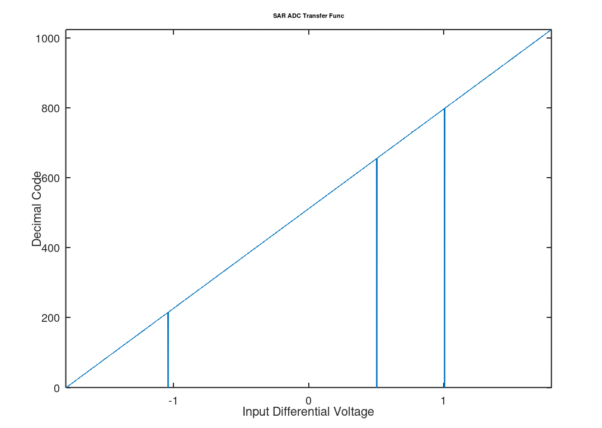
SAR ADC Stepped code responce. The three lines dropping to the code `0` represent points in the where the difference in the voltage on the rails of the capacitor array was low enough that the comparator could not resolve (please see clock_flow notes below for more information). It is unlikelky to happen in real life where noise usually pushes the comparator in one direction or another. In the unlikelky case difference (plus noise) did cause the comparator to stop resolving, the output would hold the same output of the previous sample. 

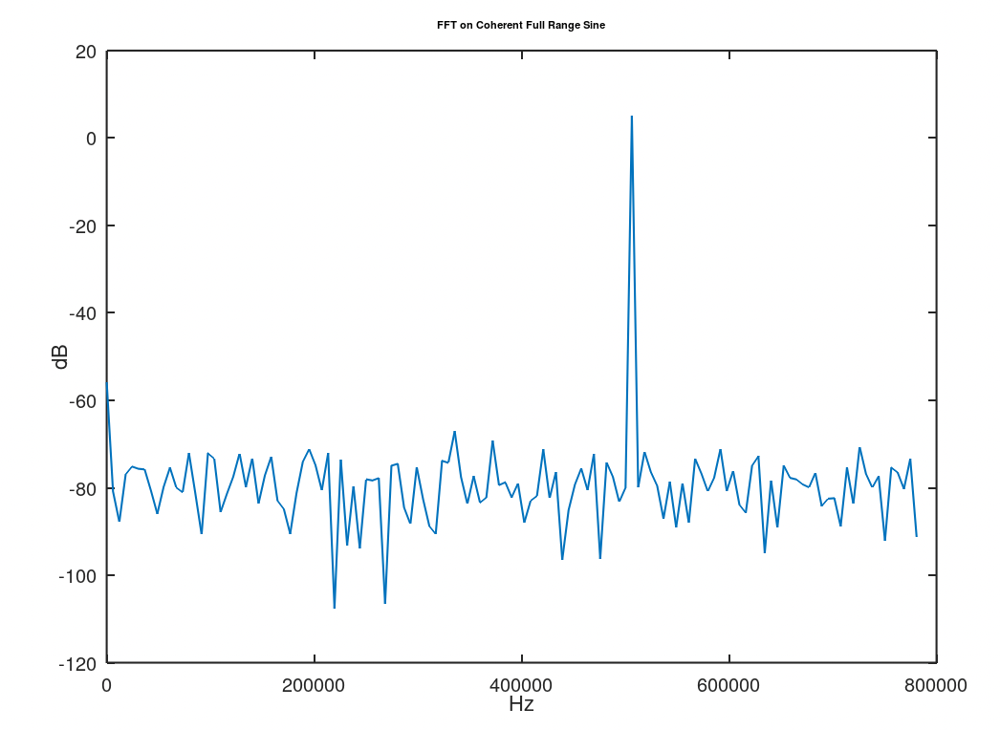
Coherent full range sine FFT.

## Overview
### Large Level Signal Flow
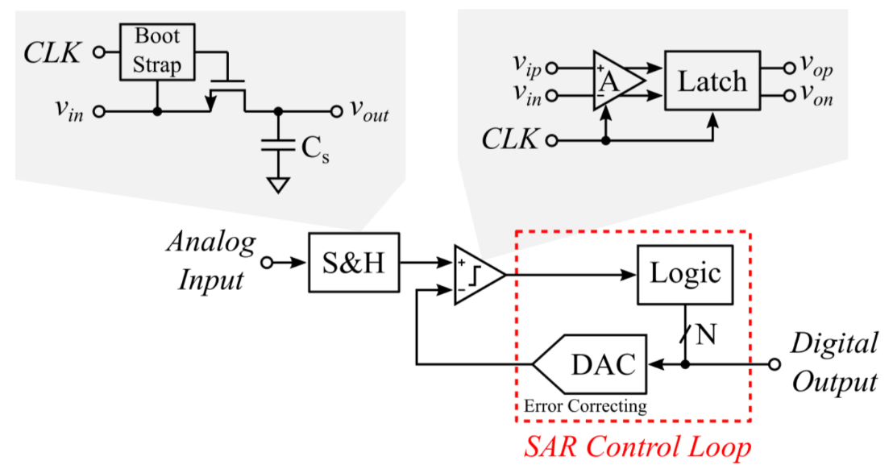
The ADC is a synchronus 10b SAR ADC featuring a full range input bootstrapped switch, MSB splitting and Correlated Reverse Switching archetecture. 


The bootstrapped switch is based on the following sources:
- Tsai, Jen-Huan, et al. "A 0.003 mm2 10 b 240 MS/s 0.7 mW SAR ADC in 28 nm CMOS With Digital Error Correction and Correlated-Reversed Switching." IEEE Journal of Solid-State Circuits 50.6 (2015): 1382-1398.
- Razavi, Behzad. "The bootstrapped switch [a circuit for all seasons]." IEEE Solid-State Circuits Magazine 7.3 (2015): 12-15.
- Wei, H., Chan, C. H., Chio, U. F., Sin, S. W., Seng-Pan, U., Martins, R., & Maloberti, F. (2011, February). A 0.024 mm 2 8b 400MS/s SAR ADC with 2b/cycle and resistive DAC in 65nm CMOS. In 2011 IEEE International Solid-State Circuits Conference (pp. 188-190). IEEE.

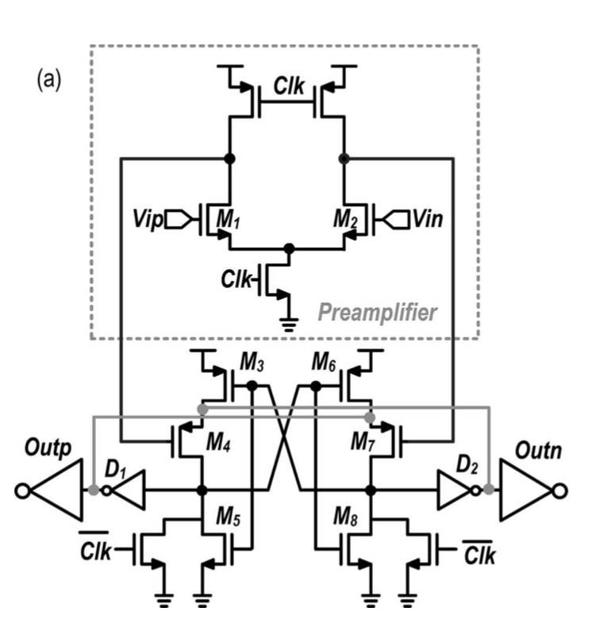
Image Source: Tsai, Jen-Huan, et al.

This comparator design has the advantage that it does not require a charge pump while also easily performing within the timing constraints required due to the feedforward latch structure.  
The comparator is based on:
- Tsai, Jen-Huan, et al. "A 0.003 mm2 10 b 240 MS/s 0.7 mW SAR ADC in 28 nm CMOS With Digital Error Correction and Correlated-Reversed Switching." IEEE Journal of Solid-State Circuits 50.6 (2015): 1382-1398.


The SAR ADC utilizes Most Significant Bit (MSB) splitting so the MSB capacitor is split into nine capacitors (shaded in gray). The effect of splitting the MSB is to create a beta encoder where the data is sampled in a radix lower than 2 (providing code redundancy and then converted to radix 2 with digital error correction logic. The MSB splitting is explained further in the design review and in Tsai, Jen-Huan, et al.


Even though the MSB is split into 9 capacitors and there are in total 13 switching states, all of the switching states must be reduced down to 10bits. Convienently with this archetecture and splitting method, the 13 raw bits may be combined with only the simple combinational logic of a set of full adders as shown above. 

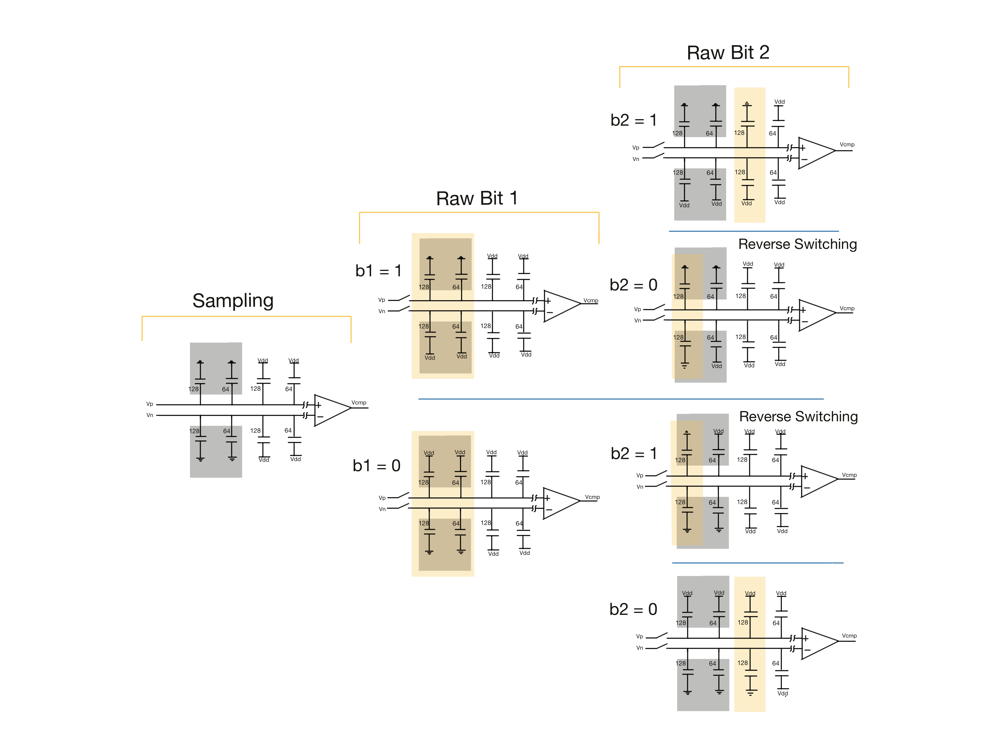
Correlated Reverse Switching (CRS) is employed to reduce matching capacitor error within the capacitor array. The basic idea is that rather than always switching the capacitors in order, the SAR ADC tries to keep the capacitors mirrored to eachother switched symetrically so that capacitors in the same region of the die are at simmilar states, eliminated matching error. CRS is explained further in the design review and in Tsai-Jen-Huan, et al. 


A key to understanding the design is to understand the clock flow. The external clock, `clk`, is first divided by 32 to create the `sample_clock` signal which drives the bootstrapped switch and locks/unlocks all switching functions of the ADC. The `clk` and `sample_clock` are AND'd to create the `comparator_clk` which drives the comparator. Since the comparator has a variable resolution time, it is nessesary to generate a new clock from the output of the comparator in the `XOR_Clock_Gen` block. This last clock signal drives the `Controller`.

## Components
### Bootstrapped Switch
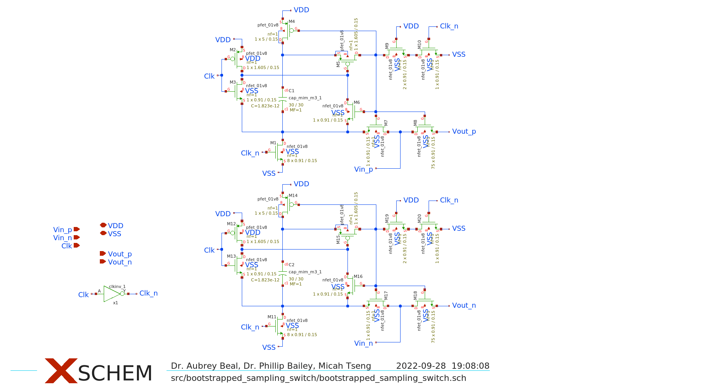

### Comparator
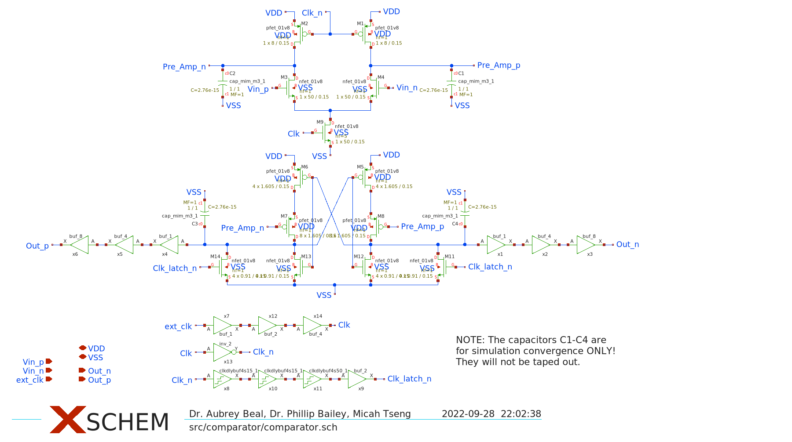

### Capacitor Array
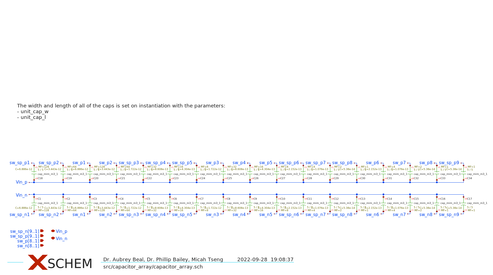

### Controller
Notes: some of these images are slightly out of date from the latest version. Please see the actual schematics for the latest version.
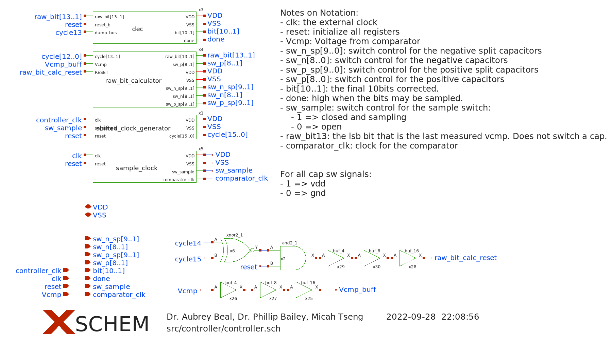
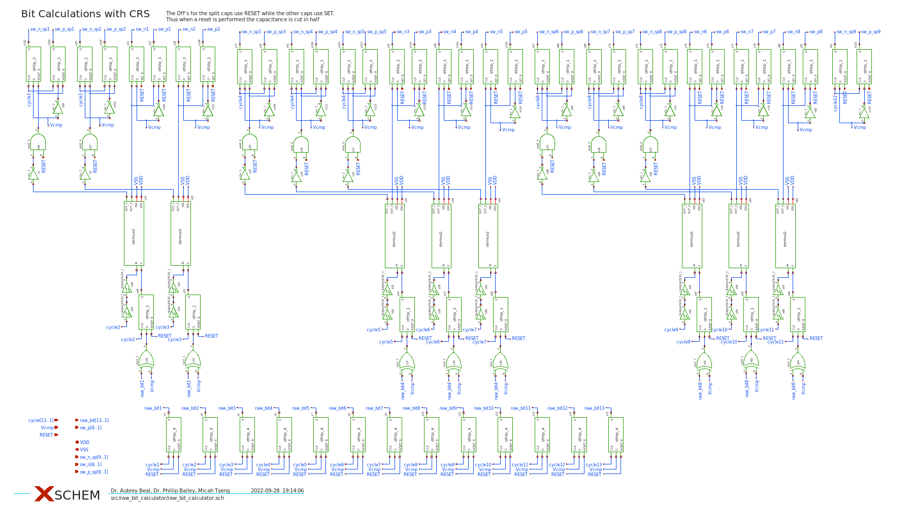


## Layout Images

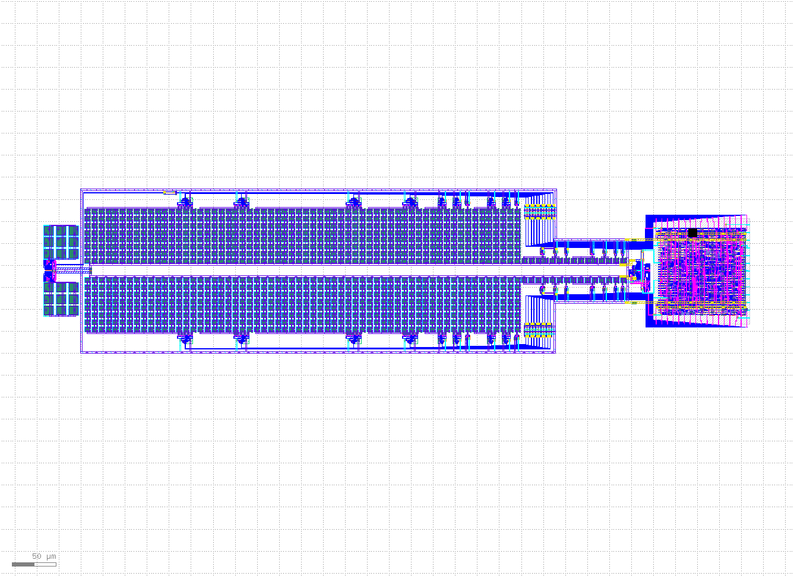
Full SAR ADC Layout.

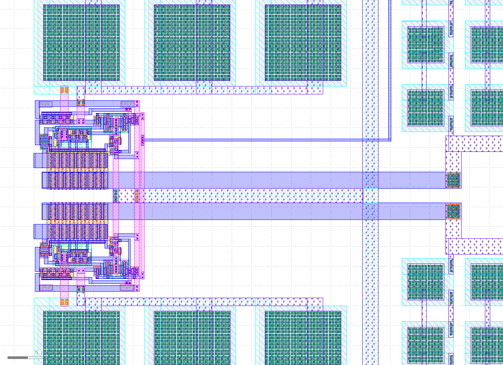
Bootstrapped Switch Layout.

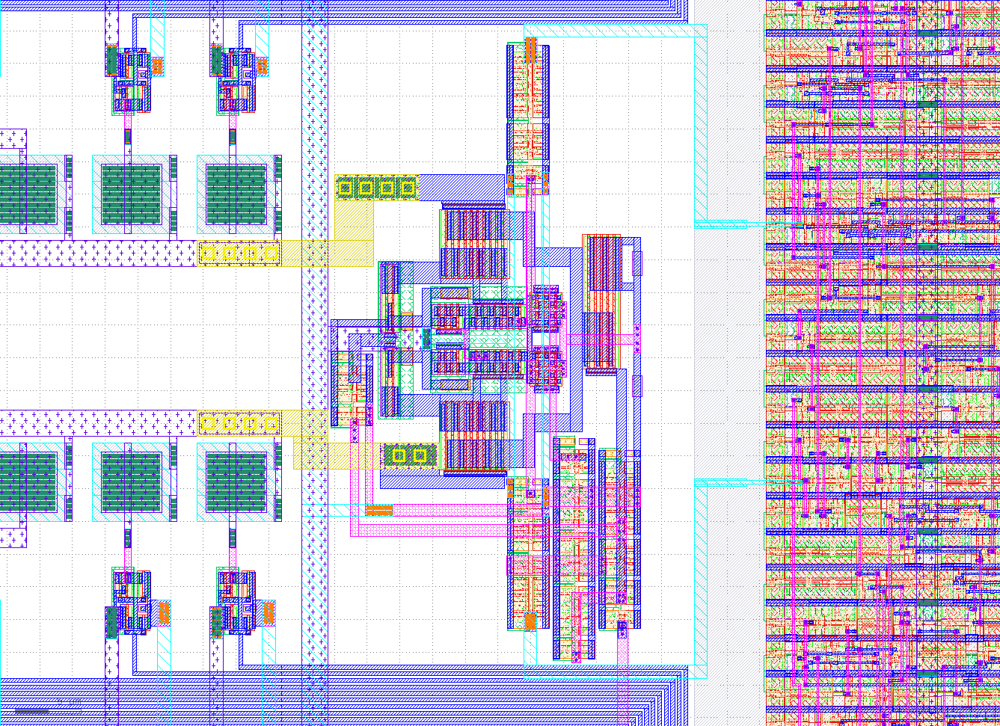
Comparator Layout.


Controller Layout. 

## Points of improvement in future revisions:
- The comparator proved to resolve much faster than originally expected so the controller may be reconfigured to operate at only a 16 clock cycle over sample rate. 
- A clock cycle can probably be saved in the reset sequence in the controller which would help lengthen the sample period for a lower over sample rate.  
- The acuracy of comparator may be further improved by replacing the input MOS with LVT MOS. 


# Development

## Design Workflow
### Analog
The analog portions of the design were created using Xschem and the Sky130A PDK.

## Digital
The digital portion of the design was designed in Xschem and then layed out using OpenLane. There were some significant issues to this process that have been improved greatly. If attempting this workflow in the future, please feel free to reachout with any questions. Below are a few resources discussing. 

- [Slack Conversation with Stefan Schippers Part 1](https://open-source-silicon.slack.com/archives/C017P3RAD42/p1669022665917229)
- [Slack Conversation with Stefan Schippers Part 2](https://open-source-silicon.slack.com/archives/C017P3RAD42/p1669070986605429)
- [Conversation and Bug Fixes with OpenLane Team](https://github.com/The-OpenROAD-Project/OpenLane/issues/1420)

### Hardening Controller
A OpenLane Fork is linked through a submodules to harden the controller. We chose to version control the OpenLane configurations and versioning through a simple fork. This might not be the best method, but it works for now.
1. Init submodule 
```
git submodule init
```
2. Install OpenLane (only need to do this once)
```
cd OpenLane
make
make test    # to verify installation
```
3. Extract Verilog Netlist
```
# cd back to sky130-10-bit-SAR-ADC directory
# The following command extracts the verilog netlist, converts the netlist
# to an OpenLane readable standard and then places it in the correct directory for OpenLane
make extract_xschem_verilog component=controller
```
If running an old version of xschem, use `make extract_xschem_verilog_old component=controller` since the Verilog netlist exportation changed. 
4. Run the Flow
```
cd OpenLane
./flow.tcl -design controller
```

The results will be located in `/OpenLane/designs/controller/runs/<run name>/results/final`. 

## DRC
Since the design was layed out in Magic, the Magic DRC is run normally within Magic. The `.magicrc` file sets DRC to Full.

Klayout DRC may be executed with `make klayout_extract_drc component=<component name>.` This target extracts the gds from magic and then runs klayout drc on the extracted gds. 


## LVS
LVS on indevidual components may be run with `make extract_and_run_component_LVS component=<component name>`. This will extract the netlists from the layout and the schematic and run netgen on them.

LVS on the full SAR ADC requires a little manual work.
1. Extract the xschem netlist with `make extract_xschem_lvs component=sar_adc`.
2. Extract the layout netlist with `make extract_magic_lvs component=sar_adc`. 
3. Manually delete the contents of the controller subcircuit in one (or both) of the netlists. This will force netgen to blackbox the controller.
4. Run negtgen lvs with `make netgen_component_lvs component=sar_adc`.

# Status

## Layout
| Component | Status | TODO |
| :--- | :--- | :--- | 
| sar_adc | complete | 😁 |
| bootstrapped_sampling_switch | complete | 😁 |
| capacitor_array | complete | 😁 |
| capacitor_switch | complete | 😁 |
| comparator | complete | 😁 |
| controller | complete | 😁 |
| dac | complete| 😁 |
| dec | complete | 😁 |
| demux2 | complete | 😁 |
| raw_bit_calculator | complete | 😁 |
| sample_clock | complete | 😁 |
| shifted_clock_generator | complete | 😁 |
| xor_clock_gen | complete | 😁 |

### Lexicon
- **complete:** fully functional and optimized.
- **functional:** executes correctly/without error, but is not optimized.
- **inprogress:** started, but not functional
- **notstarted:** nothing done yet


# Tests

## Unit Tests
All unit tests are located in the `xschem/tests` directory.

| Component | Test | Status | Purpose | Notes |
| :--- | :--- | :--- | :--- | :--- | 
| sar_adc | sar_adc_test.sch | Passing | Tests a single input value to the sar adc |  |
| sar_adc | sar_adc_2bit_test.sch | Passing | Test the full reset proceedure | |
| sar_adc | sar_adc_max_sample_rate_test.sch | Passing | Test single input value at max sample rate | ext clk = 50Mhz |
| sar_adc | sar_adc_max_sample_power_test.sch | Passing | Calculate the power consumed by the adc | |
| bootstrapped sw | bootstrapped_sampling_switch_load_test | Passing | Test a resistive load |  |
| bootstrapped sw | bootstrapped_sampling_switch_test.sch | Passing | Test with no load |  |
| bootstrapped sw | bootstrapped_sampling_switch_w_caps_test.sch | Passing | Test with cap array loading |  |
| cap array | capacitor_array_test | Passing | Make sure that the caps switch and are the correct value |  |
| cap sw 2 | capacitor_switch2_test | Passing | Make sure it switches |  |
| cap sw 4 | capacitor_switch4_test | Passing | Make sure it switches |  |
| cap sw 8 | capacitor_switch8_test | Passing | Make sure it switches |  |
| cap sw 16 | capacitor_switch16_test | Passing | Make sure it switches |  |
| comparator | comparator_fast_test.sch | Passing | Check Full Range | clk = 50MHz |
| comparator | comparator_fast_small_v_test.sch | Passing | Check Around and Below LSB | clk = 50MHz |
| comparator | comparator_test.sch | Passing | Check Full Range | slow clk |
| comparator | comparator_test_small_v_test.sch | Passing | Check Around and Below LSB | slow clk |
| comparator | comparator_stepped-test.sch | Passing | Step through input values and programtically check for correctness |  |
| comparator | comparator_fast_low_vt_small_v_test.sch | Passing | Check Around and Below LSB | Playing with low VT transistors |
| comparator | comparator_fast_low_vt_test.sch | Passing | Check full Range |  |
| controller | controller_corner_ff_test | Passing | Testing the ff corner | ext clk = 50MHz, 60C |
| controller | controller_corner_fs_test | Passing | Testing the fs corner | ext clk = 50MHz, 60C |
| controller | controller_corner_sf_test | Passing | Testing the sf corner | ext clk = 50MHz, 60C |
| controller | controller_corner_ss_test | Passing | Testing the ss corner | ext clk = 50MHz, 60C |
| dac | dac_test | Passing | Ensure switches can switch caps |  |
| dec | dec_test | Passing | Check a code and make sure it calculates correctly |  |
| demux2 | demux2_test | Passing | It's a demux |  |
| raw bit calc | raw_bit_calc_test | Passing | Make sure the bits calculate correctly |  |
| sample clock | sample_clock_test | Passing |  |  |
| shifted clock gen | shifted_clock_generator_test | Passing | Test generation of 15 pulses |  |
| xor clock gen | xor_clock_gen_test | Passing | Generate a clock from the comparator output |  |

## Large End-to-End Batched Tests
The large end-to-end tests were completed using batching on AWS Batch to allow timely completion. Each bit takes about 4 minuetes and 1.5Gbs of memory to calculate, so the tests were separated into small chunks where the input values were iteratively shifted using environment variables. Thus by containerizing the tests, we could run hundreds of docker containers in parallel to complete the simulation quickly. 

The set up for these tests can be found in the [ngspice-batch-runner](https://github.com/UAH-IC-Design-Team/ngspice-batch-runner) repository.

| Test | Status | Purpose | Notes |
| :--- | :--- | :--- | :--- |
| sar_adc_code_step_test.sch | Passing | Step through 2048 input values | |
| sar_adc_code_step_max_sample_test.sch | Passing | Step through 2048 input values | ext clk = 50MHz |
| sar_adc_sine_test.sch | Passing | Coherent sampling of a sine wave | |
| sar_adc_sine_max_sample_test.sch | Passing | Coherent sampling of a sine wave | ext clk = 50MHz |


## Tool Notes

### Xschem
Please start Xschem from the `./xschem` to ensure that the `xschemrc` is sourced.

There is a default test schematic template located `sky130-10-bit-SAR-ADC/xschem/tests/default_template_test.sch`.

### Magic
Please start Magic from the `./mag` directory to ensure that the `.magicrc` file is sourced. 

### Klayout
There are all of the needed Layout Property files and drc files needed in the `./klayout` directory.

### LVS
The Makefile has targets to extract and run lvs with the correct settings and file structure. The comparison output is placed in `./netgen`.

### DRC
Since Magic and Klayout have different DRC rules and solvers, a target in the make file has been provided to run the Klayout DRC check from the commandline and outputs the number of DRC errors. The associated drc marker log can be found in `./klayout/drc_reports`.

To view the Klayout DRC errors, open gds file with the sky130 layer property file. Then go to Tools > Marker Browser and load the DRC marker xml file. 

### Get all the devices used
Use the `get_devices_used` Makefile target to see all of the devices used in the design.

### Xspice
Xspice simulations are not currently functional. Some work neeeds to be done on modifying a flattened schematic netlist and there are odities with Q and dflops. 
